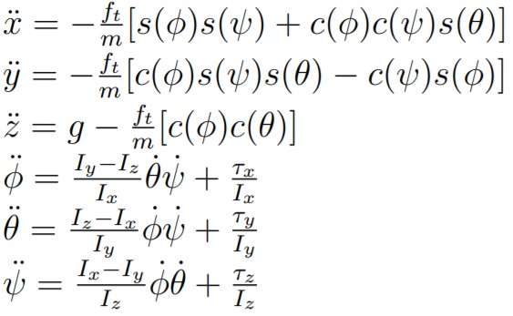
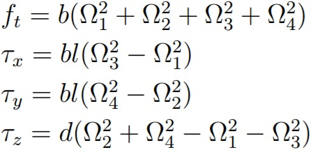
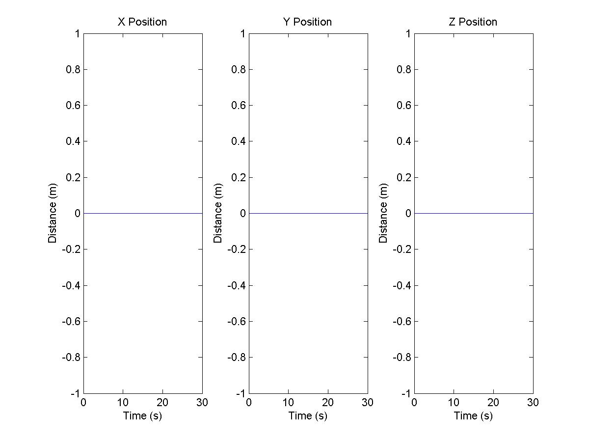
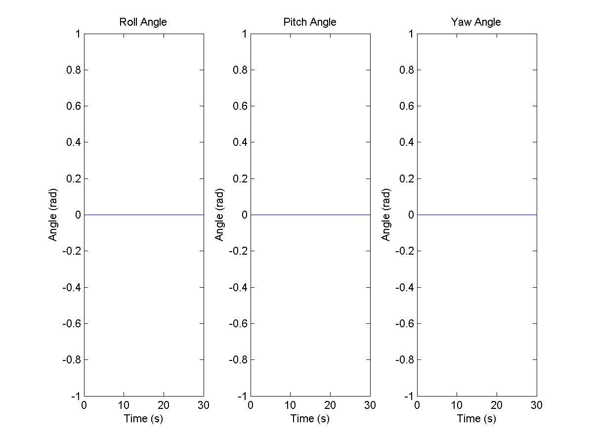

# 🚁 MATLAB Quadcopter Dynamics Simulator

A **minimalist quadcopter model and hover simulation** built in **MATLAB/Octave**, based on Francesco Sabatino’s master thesis at KTH. This project demonstrates the basic 6-DOF rigid-body dynamics of a quadrotor in free flight, focusing on attitude and position evolution over time.

---

## 📘 Reference

Francesco Sabatino, *“A Unified Approach to Quadcopter Control”*, KTH Master Thesis, 2015.  
📄 [Download PDF](https://www.kth.se/polopoly_fs/1.588039.1550155544!/Thesis%20KTH%20-%20Francesco%20Sabatino.pdf)

---

## 📁 Project Structure

```

Matlab-Quadcopter-Dynamics-Simulator/
├── LICENSE                        # MIT License
├── README.md                      # Project documentation
├── pictures/                      # Visual explanation
│   ├── control_input.jpg          # Force/torque illustration
│   ├── figure1.jpg                # Example position output
│   ├── figure2.jpg                # Example orientation output
│   └── quad_equation.jpg          # Dynamics equations
├── project/                       # MATLAB source code
│   ├── quadvar.m                  # System parameters and initial conditions
│   ├── quadmodel.m                # State update equations (Euler integration)
│   ├── quadrun.m                  # Main runner script (initialization + simulation)
│   └── quadplot.m                 # Plotting utility

```

---

## 🧠 Overview of System Dynamics

### 📷 Quadcopter Equation of Motion



### 🧭 Control Input Diagram

The control input vector:
- **u₁**: total thrust
- **u₂, u₃, u₄**: roll, pitch, and yaw torques



These are derived from rotor speeds and used in the Newton–Euler equations to simulate translational and rotational motion.

---

## 💻 Prerequisites

- MATLAB **R2018a+** or GNU Octave **v4.0+**
- No additional toolboxes required
- Add `/project` folder to your MATLAB/Octave path

---

## ▶️ How to Run

1. Clone or download the repo:
   ```bash
   git clone https://github.com/yourname/matlab_quadcopter.git
   ```

2. Open MATLAB or Octave and set the working directory to `/project`
3. Run the simulation:

   ```matlab
   quadrun
   ```

4. The script simulates **30 seconds of hover flight** and saves two output plots:

   * `figure1.jpg`: position in X, Y, Z axes
   * `figure2.jpg`: orientation angles (Roll, Pitch, Yaw)

---

## 📊 Sample Outputs

| Position (X, Y, Z)        | Orientation (Roll, Pitch, Yaw) |
| ------------------------- | ------------------------------ |
|  |       |

---

## ⚙️ Code Breakdown

### `quadvar.m`

* Defines parameters: mass `m`, arm length `l`, thrust `b`, drag `d`, inertia `I_x, I_y, I_z`
* Initial rotor speeds: `w1–w4` (hover state)
* Sets simulation time step and duration

### `quadmodel.m`

* Computes control inputs `u₁–u₄` from motor speeds
* Applies Newton–Euler equations to update:

  * Position (`x, y, z`)
  * Attitude (`ϕ, θ, ψ`)
  * Velocities and angular rates
* Euler method used for time integration

### `quadrun.m`

* Main entry point:

  * Initializes state
  * Calls dynamics step for each frame
  * Saves data and calls `quadplot`

### `quadplot.m`

* Plots position and orientation versus time
* Saves figures to `figure1.jpg` and `figure2.jpg`

---

## 🧪 Possible Extensions

* 🧭 **PID / LQR Control**: Add a control law in `quadmodel.m`
* 🕹️ **Trajectory Tracking**: Define time-varying setpoints for position/orientation
* 🎥 **3D Animation**: Use `plot3` or `patch` to render quadrotor motion
* 📓 **Live Script**: Convert to `.mlx` for interactive UI

---

## 📄 License

This project is licensed under the [MIT License](LICENSE).

---

## 🙋‍♂️ Credits

Developed by **Ardy Seto Priambodo**
✉️ [2black0@gmail.com](mailto:2black0@gmail.com)

---

## 🚀 Citation

If you use this project in academic work, please cite:

```bibtex
@misc{matlab_quadcopter,
  author       = {Ardy Seto Priambodo},
  title        = {MATLAB Quadcopter Simulator},
  year         = {2023},
  howpublished = {\url{https://github.com/2black0/MATLAB-Quadcopter-Dynamics-Simulator}},
  note         = {Based on Francesco Sabatino's thesis at KTH}
}
```

---

Fly safely (virtually)! 🚁
